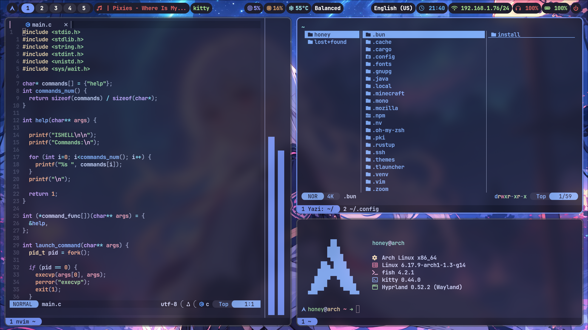
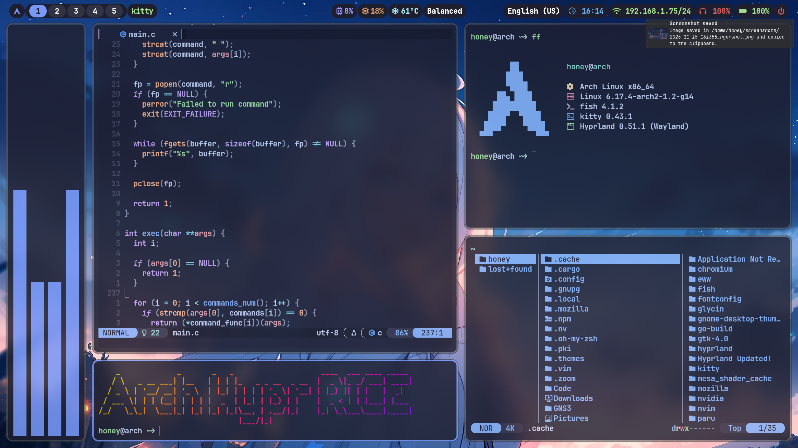
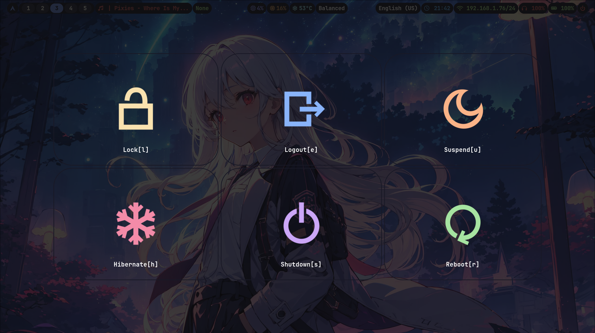
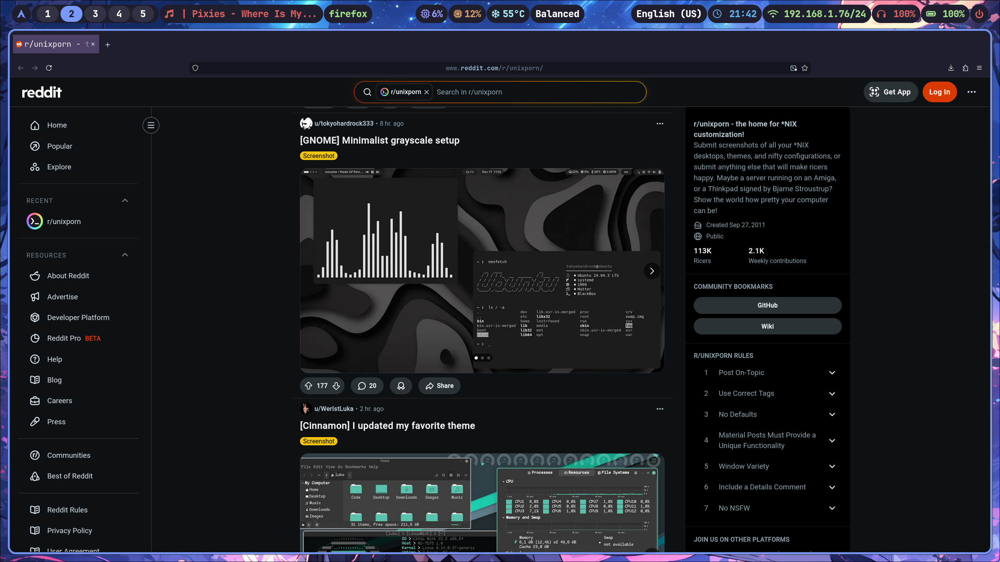
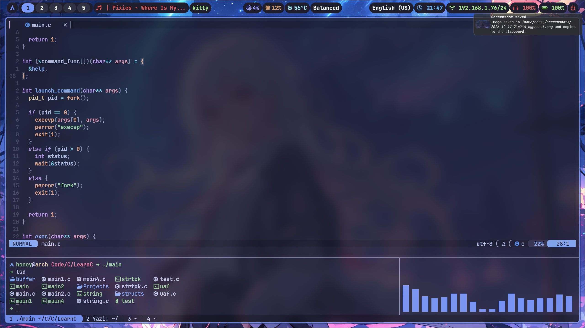
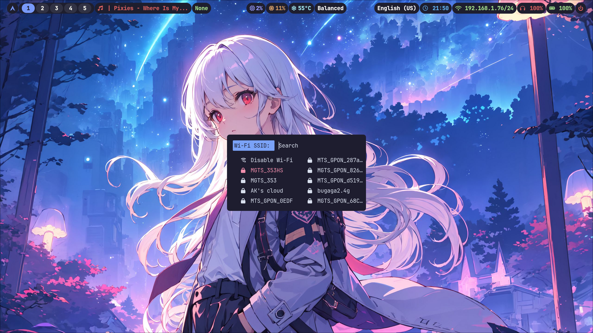

<h1 align="left"> :blue_book: About</h1> 

This is info about my Hyprland setup for writing code and studying

 

 - OS: [**`Arch Linux`**](https://archlinux.org/)
 - WM && Compositor: [**`Hyprland`**](https://github.com/hyprwm/Hyprland)
 - Bar: [**`Waybar`**](https://github.com/Alexays/Waybar)
 - Terminal: [**`Kitty`**](https://github.com/kovidgoyal/kitty)
 - App Launcher: [**`Rofi`**](https://github.com/davatorium/rofi)
 - Shell: [**`Fish`**](https://github.com/fish-shell/fish-shell)
 - Shell Prompt: [**`Starship`**](https://github.com/starship/starship)
 - Editor: [**`Nvim`**](https://github.com/neovim/neovim)
 - File Manager: [**`Yazi`**](https://github.com/sxyazi/yazi)
 - Logout Menu: [**`Wlogout`**](https://github.com/ArtsyMacaw/wlogout)
 - Lock Menu [**`Hyprlock`**](https://github.com/hyprwm/hyprlock)

 

## 🖼️ Gallery

## 🚀 Features
* Convenient custom configuration of Firefox.
* Hotkeys for maximum productivity.
* A very lightweight system that consumes less than 2% of CPU.
